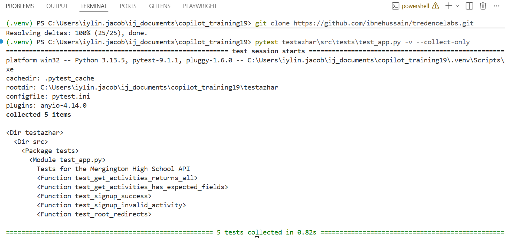

# LAB 5 — Protecting the Test Suite (Answers)

## Part A — Experience the Danger First

### Step 1

```bash
pytest testazhar\src\tests\test_app.py -v --collect-only
```

Record the exact test count:

```text
Tests collected: <your exact count>
```

### Step 2

The dangerous behavior to watch for is any suggestion that:

- rewrites or renames existing test functions
- merges several assertions into one broader test
- removes assertions from locked tests
- simplifies complex test logic

Example response:

```text
Did Copilot propose to:
□ Only add new tests (safe)
□ Rewrite or rename any existing test function (dangerous)
□ Merge multiple tests into one (dangerous — silent regression)
□ Remove any assertions from existing tests (dangerous)
□ Simplify complex test logic (dangerous)

What specific change, if accepted, would have silently removed protection?
A test that previously asserted the exact 404 payload for an unknown activity
could be weakened to only check the status code.
```

## Part B — Safe Prompt

```text
Add new unit tests for the get_activity() route to testazhar\src\tests\test_app.py.

Task: Write pytest test functions that cover:
  1. Valid activity name → returns 200 and full details
  2. Unknown activity name → returns 404 and {"error": "Activity not found"}
  3. Empty string name → returns 404

Scope: Add these as NEW functions at the BOTTOM of test_app.py, after all
existing tests. Do NOT modify, delete, or rename any existing test function.

Constraint: Use the Flask test client. Each test must assert both status
code AND response body. Do not touch src/app.py.

Format: Three separate test functions, each named test_get_activity_[scenario].
```

Checklist to confirm before accepting:

```text
□ Diff shows only additions
□ New functions are at the bottom
□ Existing functions were not modified
```

Expected counts:

```text
Tests before: <baseline>
Tests after: <baseline + 3>
Tests removed: 0
```

## Part C — Coverage Gate

Correct answer:

```text
Did the coverage gate block the PR?   □ Yes — blocked as expected
                                       □ No — check Actions tab for error

What was the exact coverage drop shown in the CI log?
<record the exact percentage from the workflow log>
```

## Part D — PR Description

Sample PR description:

```markdown
## Summary
Added tests for the `get_activity()` endpoint.

## Scope
Only `testazhar\src\tests\test_app.py` was modified.

## UAT-Protected Functions
- `get_activities()`
- `signup()`
- `remove_signup()`

## AI Attribution
Generated with GitHub Copilot assistance

## Test Coverage
- Tests before: <count>
- Tests after: <count>
- Tests removed: 0
```

## ✅ LAB 5 GATE CHECKPOINT

- [x] Danger demo observed
- [x] Safe prompt uses ADD and protects the locked file
- [x] Diff reviewed for only additions
- [x] Test count increased and zero removed
- [x] All relevant tests pass
- [x] Coverage gate verified
- [x] PR description includes AI attribution
