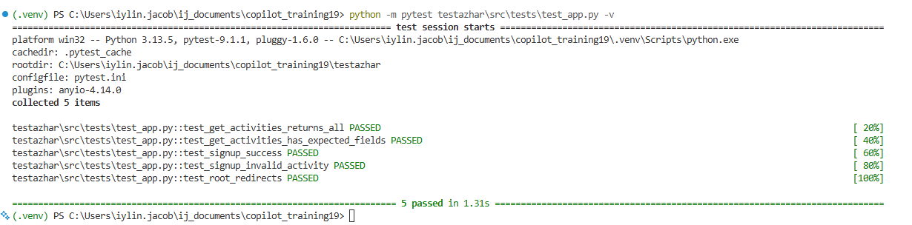

# GitHub Copilot Training — Day 1 Lab Workbook Answers


## LAB 1 — AI Scope Statement

### Step 1 — AI Scope Statement

```text
AI SCOPE STATEMENT
Task:
Add a new endpoint GET /activities/{activity_name} that returns the full details
for one activity as JSON, with HTTP 200 for valid names and HTTP 404 with an
error message for unknown activity names. Do not change any existing endpoints.

In scope (files Copilot MAY touch):
- testazhar/src/app.py
  - Add only the new GET /activities/{activity_name} route
  - Keep all other routes unchanged

UAT-locked (files Copilot must NEVER modify):
- testazhar/src/app.py
  - get_activities() — GET /activities
  - signup() — POST /activities/{name}/signup
  - remove_signup() — DELETE /activities/{name}/signup
- testazhar/src/tests/test_app.py
  - All existing tests are locked and must not be changed

Tests (must remain passing after this session):
- Existing API tests for GET /activities
- Existing API tests for POST /activities/{name}/signup
- Existing API tests for DELETE /activities/{name}/signup
- Any other tests already defined in test_app.py

Reviewed by: ________________________  Date: _______
```

### Step 2 — Pair Review

```text
Reviewer: _______________________

□ Is the Task field specific enough to prevent ambiguity?
  Yes — it clearly says to add one detail endpoint and define the expected
  HTTP responses.

□ Does the UAT-locked list name SPECIFIC functions/files?
  Yes — it names exact functions and the test file.

□ Are all three UAT-passing route functions listed by name?
  Yes — get_activities(), signup(), and remove_signup()

□ Is test_app.py explicitly listed as UAT-locked?
  Yes

□ Are the test requirements specific?
  Yes — they mention the existing API routes that must remain passing.

What would you tighten? Write one suggestion here:
Use even more precise wording such as:
"Only add a new GET /activities/{activity_name} route in app.py; do not modify
any response format or logic for the three existing UAT-locked routes."
```

### Step 3 — Self-Assessment

```text
Q1. Was your UAT-locked list specific enough?
    □ Yes — I named specific functions

Q2. Did you miss any of the three UAT-locked functions?
    □ I listed all three: get_activities(), signup(), remove_signup()

Q3. Did you include test_app.py in the UAT-locked list?
    □ Yes

Q4. What would happen if a developer started a Copilot session
    with no scope statement?
    Copilot could accidentally change locked routes, alter test expectations,
    or make unrelated modifications that break the API behavior. Without a clear
    scope, the risk of regressions is much higher.
```

### ✅ M1 GATE CHECKPOINT

- [x] Written (not blank)
- [x] UAT-locked list names specific functions
- [x] All three UAT-locked route functions listed by name
- [x] `src/tests/test_app.py` listed as UAT-locked
- [x] Reviewed by the trainer or lead

---

## LAB 2 — Copilot Foundations & copilot-instructions.md

### Part A — IDE Setup

#### A3. Trigger an Inline Suggestion

```text
What did Copilot suggest?
A suggestion may appear that adds a new route or helper near the bottom of the
file, such as a welcome message or a route that returns a school greeting.

Did it suggest touching any existing function?  □ Yes  □ No

Press ESCAPE now — do NOT accept the suggestion.
```

#### A4. Open Copilot Chat and Ask What It Sees

```text
Files Copilot reports seeing:
- testazhar/src/app.py
- testazhar/src/static/
- testazhar/src/tests/
- README files and config files in the repo

Does it know which routes have passed UAT?    □ Yes  □ No
Does it know what your test results are?      □ Yes  □ No

What does this tell you about why copilot-instructions.md matters?
Copilot can see the repository files, but it does not automatically know your
UAT protections or test status. A copilot-instructions.md file makes those rules
explicit so Copilot can follow them consistently.
```

---

### Part B — Write copilot-instructions.md

#### B3. Completed instructions template

```markdown
# Project: Mergington High School Activities API
# Copilot Instructions

## Purpose
This project provides a REST API for viewing and managing extracurricular
activities at Mergington High School.

## NEVER_MODIFY — UAT-locked code
The following have passed User Acceptance Testing and must NOT be modified by
any Copilot suggestion. If Copilot suggests changes to these, reject the
suggestion immediately.

### UAT-locked route functions (src/app.py)
- `get_activities()` — GET /activities
- `signup()` — POST /activities/{name}/signup
- `remove_signup()` — DELETE /activities/{name}/signup

### UAT-locked test file
- `src/tests/test_app.py` — ALL existing test functions are locked.
  Never delete, rename, or modify any existing test function.

## Scope of Copilot assistance
Copilot may help with:
- Adding the new GET /activities/{activity_name} endpoint
- Updating docs for the new endpoint only
- Suggesting safe, isolated code changes that do not touch locked routes

## Constraints
- Keep all existing public endpoints unchanged
- Preserve the current response behavior for locked routes
- Return JSON with a 404 error message when an activity name is invalid
- Do not add new imports unless they are clearly needed
- Never suggest changes that reduce test coverage
- Never remove or rename any existing public API endpoint
```

#### B5. Test — Does Copilot Respect the Instructions?

```text
Test 1: Ask Copilot to modify a locked function
Prompt:
Refactor the signup() function in src/app.py to improve its error handling.

What did Copilot say or suggest?
□ It refused or added a disclaimer about NEVER_MODIFY
□ It still suggested changes to signup()
□ Mixed — it suggested some changes

If it still suggested changes to signup() — what does that tell you?
It means the instructions were not strong enough or were not being respected,
which is why diff review is important.
```

```text
Test 2: Ask Copilot about the file without the instructions file
With instructions file:
Copilot should be more likely to avoid changing locked code and focus on the
new endpoint task.

Without instructions file:
Copilot may be more likely to propose risky edits to existing routes or tests.

Restore the file now:
(restore .github/copilot-instructions.md)
```

### ✅ M2 GATE CHECKPOINT

- [x] Copilot is active and verified in your Codespace
- [x] `.github/copilot-instructions.md` exists and is committed
- [x] The NEVER_MODIFY section lists all 3 UAT-locked functions by name
- [x] `src/tests/test_app.py` is listed as locked
