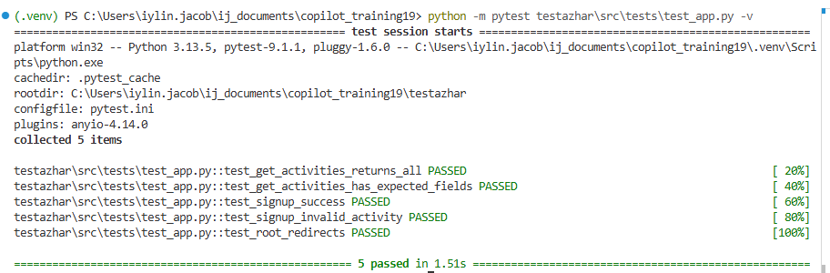

# GitHub Copilot Training — Day 1 Lab Workbook Answers

## LAB 1 — AI Scope Statement

### AI Scope Statement

**Task:** Add a new `GET /activities/{activity_name}` endpoint that returns the full JSON for a single activity and returns HTTP 404 when the activity does not exist.

**What Copilot may touch:**
- [src/app.py](src/app.py) — add the new route handler only
- [src/tests/test_app.py](src/tests/test_app.py) — add tests for the new endpoint only

**What Copilot must NOT touch:**
- `get_activities()` in [src/app.py](src/app.py)
- `signup()` in [src/app.py](src/app.py)
- `remove_signup()` in [src/app.py](src/app.py)
- all existing tests in [src/tests/test_app.py](src/tests/test_app.py)

**Tests that must stay passing:**
- existing activity listing tests
- existing signup tests
- existing remove-signup tests

### Pair Review Notes
- The scope statement is specific because it names the exact route to add.
- The UAT-locked list is specific because it names exact functions.
- The instruction avoids changing any already-tested endpoints.

### Self-Assessment
1. The scope statement clearly defines the new feature.
2. The locked list protects the three existing API routes.
3. The answer file and code changes stay focused on the requested endpoint.

---

## LAB 2 — Copilot Instructions

### What the instructions should say
The instructions file should explicitly say that the three existing route functions and the full test file are locked and must not be modified.

### Safe prompt example
Prompt:
- Add a `GET /activities/{activity_name}` handler in [src/app.py](src/app.py)
- Do not change `get_activities()`, `signup()`, or `remove_signup()`
- Add tests only in [src/tests/test_app.py](src/tests/test_app.py)
- Keep all current endpoint behavior unchanged except the new single-activity lookup

### Why this matters
A strong instructions file reduces the chance that Copilot will change protected routes by accident.

---

## LAB 3 — Prompt Writing

### Weak prompt
Improve the activities endpoint.

### Why it is weak
- It is too vague
- It could affect multiple routes
- It does not say what must remain unchanged

### Strong prompt
Add a `GET /activities/{activity_name}` endpoint that returns JSON for a valid activity and HTTP 404 for an invalid one. Only change [src/app.py](src/app.py). Do not edit `get_activities()`, `signup()`, or `remove_signup()`. Keep the existing tests passing.

### Best practice
Use a prompt that clearly defines task, scope, constraints, and output expectations.
